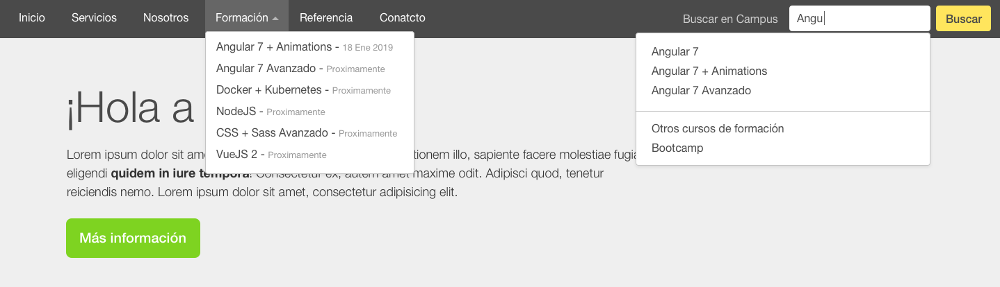
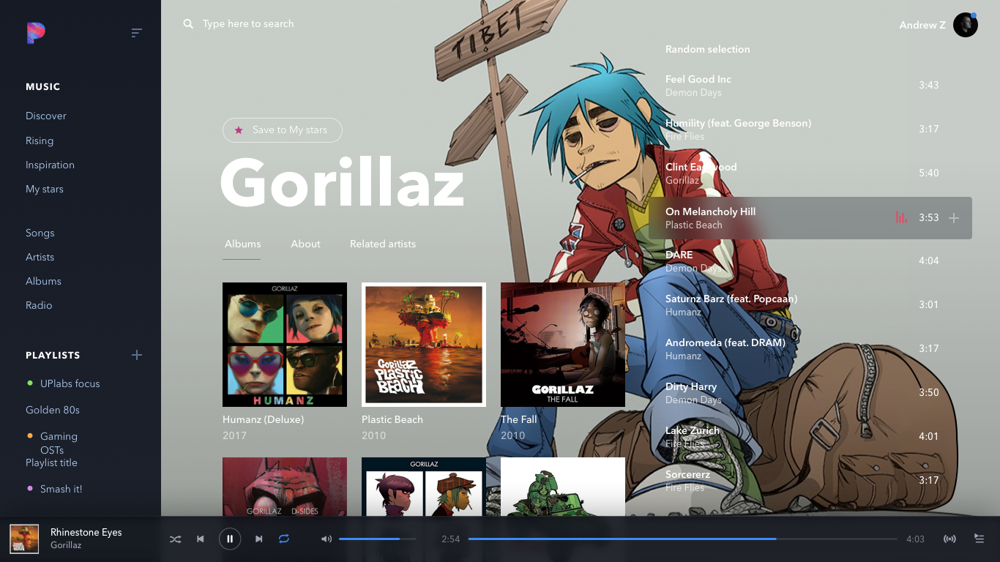

# Aplicando HTML5 y nuevas funcionalidades a la Home

Retomamos el [ejercicio de la semana 1 día 2](https://github.com/campusboream/week1_day2) y aplicamos una estructura en HTML 5. Además, vamos a realizar nuestras primeras interacciones tal y como muestra la siguiente imagen:



## Dropdown

El menú de navegación incluye un desplegable que ha de mostrarse cuando el usuario hace click sobre "Formación". Tenemos a disposición una función JavaScript que se encuentra en el fichero `toggler.js` y unos estilos CSS asociados en el fichero `toggler.css`. Así pues tendremos que hacer referencia a ellos en nuestro documento HTML.

### Ejemplo de uso

```HTML
<div class="dropdown">
  <a href="#" role="button" class="dropdown__btn" id="dropdownMenuButton" aria-haspopup="true" aria-expanded="false">
    Formación
  </a>
  <div class="dropdown__menu" aria-labelledby="dropdownMenuButton">
    <a href="#">Angular 7 + Animations</a>
    <a href="#">Angular 7 Avanzado</a>
    <a href="#">Docker + Kubernetes</a>
    <a href="#">NodeJS</a>
    <a href="#">CSS + Sass Avanzado</a>
    <a href="#">VueJS 2</a>
    <div aria-hidden="true" class="dropdown__menu--divider"></div>
    <a href="#">Bootcamp</a>
  </div>
</div>
```

## Sugerencias de búsqueda

En este caso las sugerencias aparecerán cuando el campo `input` toma el foco del navegador. Tanto la función JavaScript como los estilos CSS se encuentran en los ficheros antes mencionados.

### Ejemplo de uso

```HTML
<div class="search" id="Sugerencias">
  <input type="text" class="search__input" aria-haspopup="true" aria-expanded="false">
  <div class="dropdown__menu" aria-labelledby="searchAutocomplete">
    <a href="#">Angular 7</a>
    <a href="#">Angular 7 + Animations</a>
    <a href="#">Angular 7 Avanzado</a>
    <div aria-hidden="true" class="dropdown__menu--divider"></div>
    <a href="#">Otros cursos de formación</a>
    <a href="#">Bootcamp</a>
  </div>
</div>
```
---

## Reproductor de música

En caso de terminar a tiempo el ejercicio, comenzar a estructurar el reproductor de música que se muestra a continuación. Encuentras el diseño en este mismo repositorio y aplicarás todo lo aprendido sobre HTML 5.


